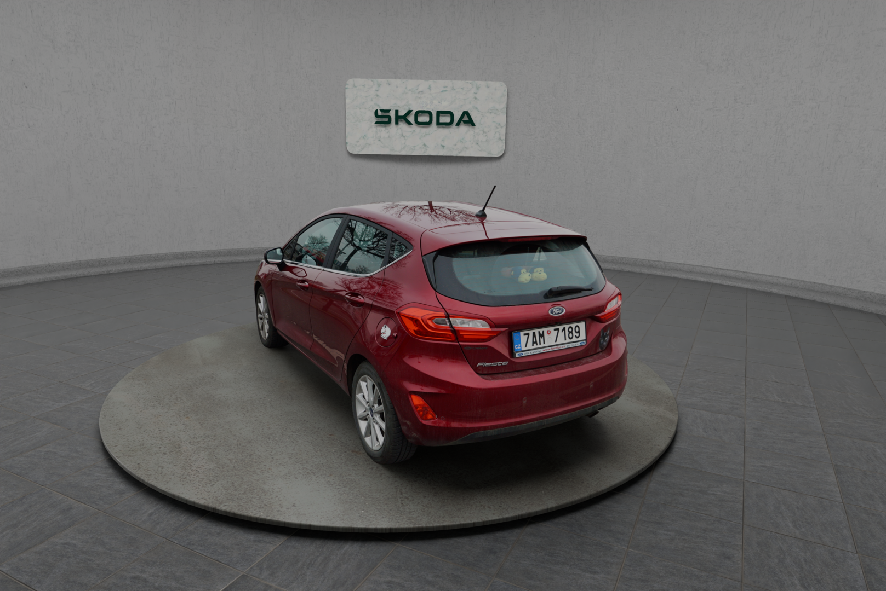
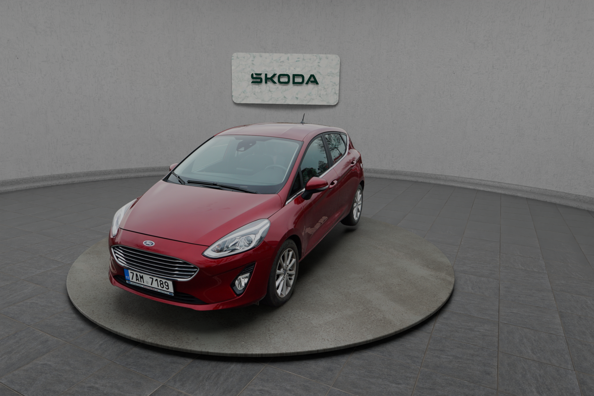
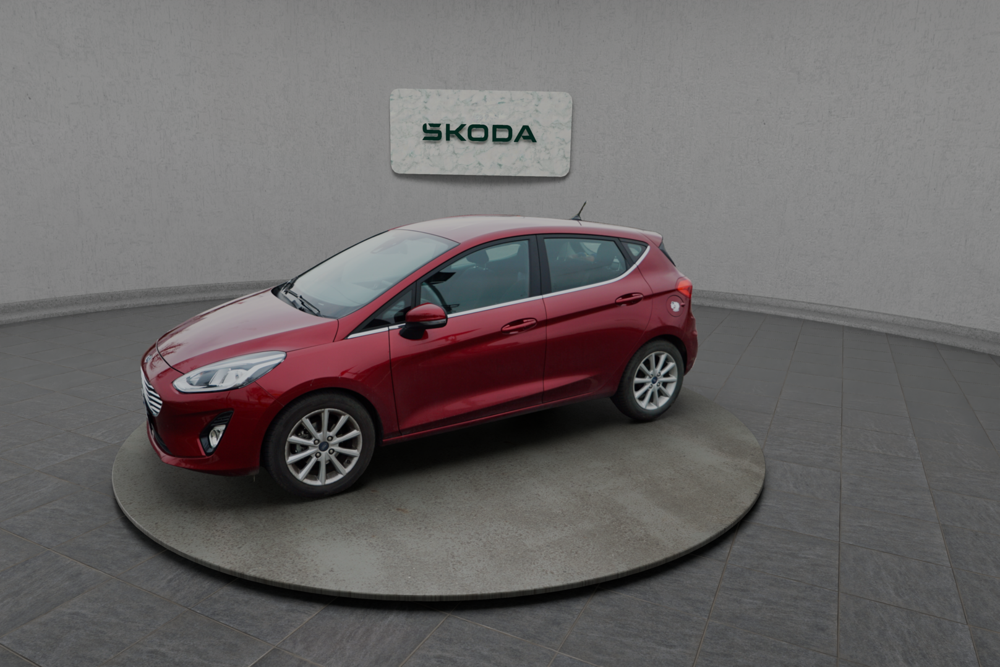
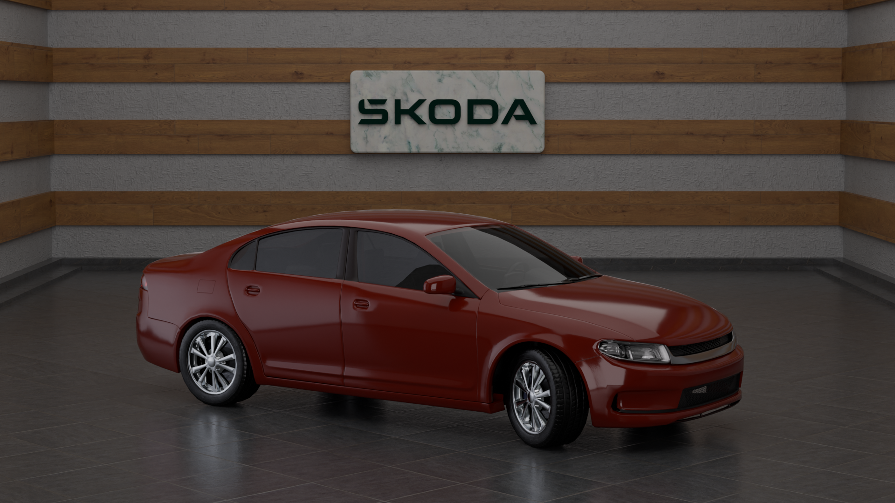
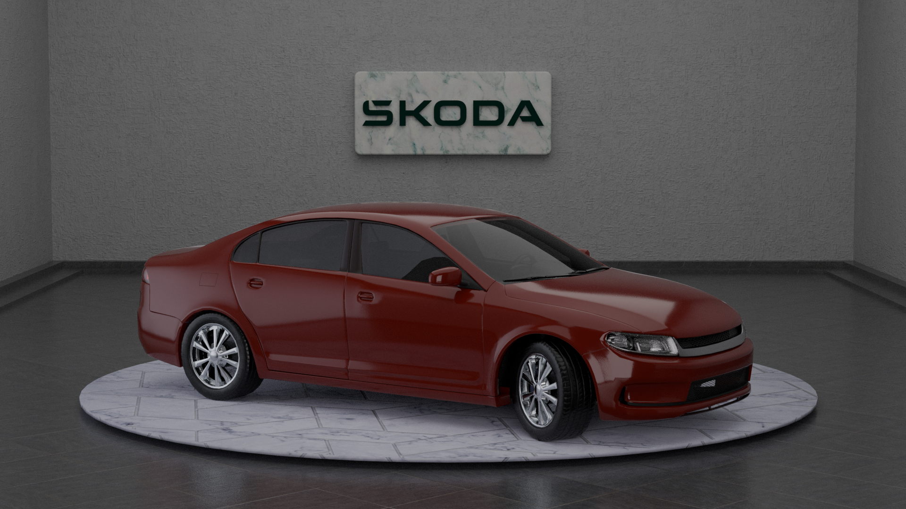
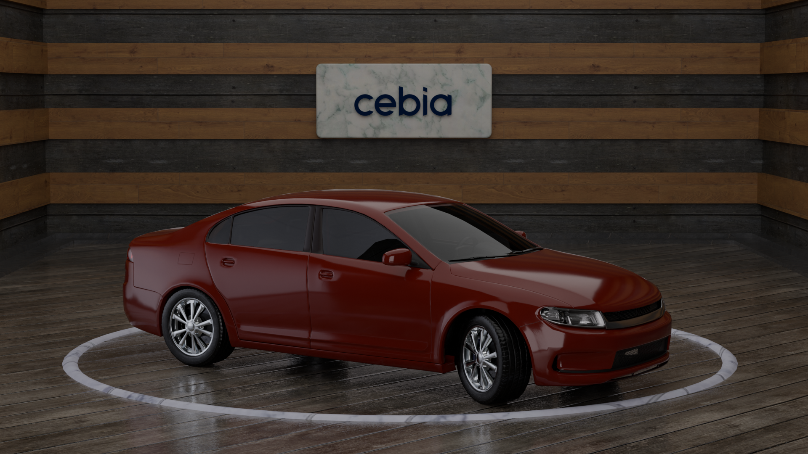
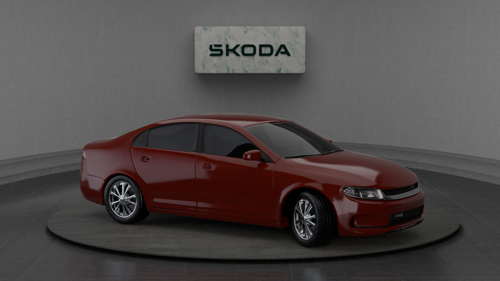
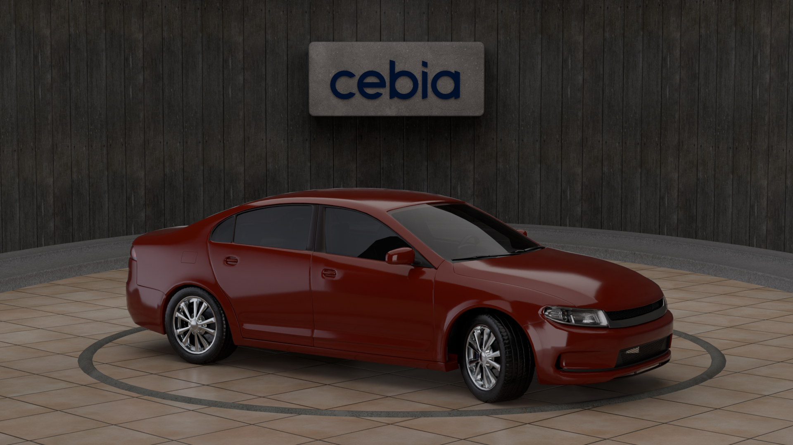

# Car Showroom

Freelance Blender project — a fully configurable virtual showroom room developed
for a client using COLMAP photogrammetry-based car assets.

The showroom environment (lighting, materials, room shape, branding) is fully
customizable via a Blender addon UI panel. The client supplies car photos;
COLMAP reconstructs the geometry which is then composited into the scene.

## COLMAP renders

Cars reconstructed from real photos via COLMAP, composited into the showroom.

## Room variants

Renders using a downloaded car model to showcase different room configurations.

